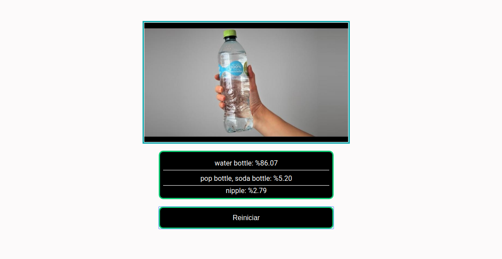

## TensorflowJS + ReactJS - Object Detector Mobilenet


In the project directory, you can run:

```bash
  $ yarn install
```

```bash
  $ yarn start
```

Open [http://localhost:3000](http://localhost:3000) to view it in the browser.



### Consult Tensorflow models
> https://github.com/tensorflow/tfjs-models


